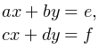

   

      <h1 class="title">J. Система линейных уравнений - 2</h1>
      <table>
         <tr class="time-limit">
            <td class="property-title">Ограничение времени</td>
            <td>1&nbsp;секунда</td>
         </tr>
         <tr class="memory-limit">
            <td class="property-title">Ограничение памяти</td>
            <td>64Mb</td>
         </tr>
         <tr class="input-file">
            <td class="property-title">Ввод</td>
            <td colspan="1">стандартный ввод или input.txt</td>
         </tr>
         <tr class="output-file">
            <td class="property-title">Вывод</td>
            <td colspan="1">стандартный вывод или output.txt</td>
         </tr>
      </table>
   

   <h2></h2>
   

         
Даны числа a, b, c, d, e, f. Решите систему линейных уравнений 
         

 
      

   

   <h2>Формат ввода</h2>
   

         
Вводятся 6 вещественных чисел - коэффициенты уравнений. 
         

   <h2>Формат вывода</h2>
   

         
Вывод программы зависит от вида решения этой системы. Если система не имеет решений, то программа должна вывести единственное
            число 0. Если система имеет бесконечно много решений, каждое из которых имеет вид y=kx+b, то программа должна вывести число 1, а затем значения k и b. Если система имеет единственное решение (x0,y0), то программа должна вывести число 2, а затем значения x0 и y0. Если система имеет бесконечно много решений вида x=x0, y&nbsp;— любое, то программа должна вывести число 3, а затем значение x0. Если система имеет бесконечно много решений вида y=y0, x&nbsp;— любое, то программа должна вывести число 4, а затем значение y0. Если любая пара чисел (x,y) является решением, то программа должна вывести число 5.
         

         
Числа x0 и y0 будут проверяться с точностью до пяти знаков после точки.
         

   <h3>Пример 1</h3>
   <table class="sample-tests">
      <thead>
         <tr>
            <th>Ввод</th>
            <th>Вывод</th>
         </tr>
      </thead>
      <tbody>
         <tr>
            <td><pre>1
0
0
1
3
3
</pre></td>
            <td><pre>2 3 3
</pre></td>
         </tr>
      </tbody>
   </table>
   <h3>Пример 2</h3>
   <table class="sample-tests">
      <thead>
         <tr>
            <th>Ввод</th>
            <th>Вывод</th>
         </tr>
      </thead>
      <tbody>
         <tr>
            <td><pre>1
1
2
2
1
2
</pre></td>
            <td><pre>1 -1 1
</pre></td>
         </tr>
      </tbody>
   </table>
   <h3>Пример 3</h3>
   <table class="sample-tests">
      <thead>
         <tr>
            <th>Ввод</th>
            <th>Вывод</th>
         </tr>
      </thead>
      <tbody>
         <tr>
            <td><pre>0
2
0
4
1
2
</pre></td>
            <td><pre>4 0.5
</pre></td>
         </tr>
      </tbody>
   </table>

