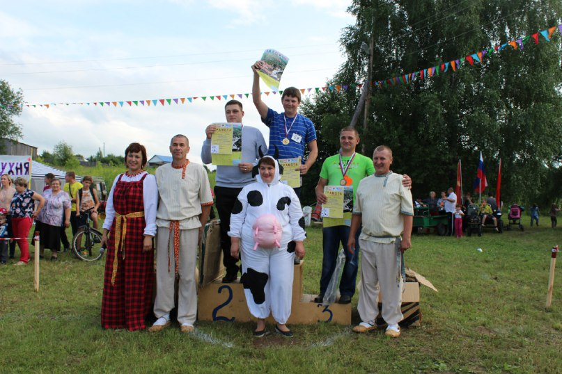

   

      <h1 class="title">E. Чемпионат по метанию коровьих лепешек</h1>
      <table>
         <tr class="time-limit">
            <td class="property-title">Ограничение времени</td>
            <td>1&nbsp;секунда</td>
         </tr>
         <tr class="memory-limit">
            <td class="property-title">Ограничение памяти</td>
            <td>64Mb</td>
         </tr>
         <tr class="input-file">
            <td class="property-title">Ввод</td>
            <td colspan="1">стандартный ввод или input.txt</td>
         </tr>
         <tr class="output-file">
            <td class="property-title">Вывод</td>
            <td colspan="1">стандартный вывод или output.txt</td>
         </tr>
      </table>
   

   <h2></h2>
   

         
Ежегодный турнир «Веселый коровяк» — по метанию коровьих лепешек на дальность — прошел 8–9 июля в селе Крылово Осинского района
            Пермского края.
         

Участники соревнований кидают «снаряд» — спрессованный навоз, выбирая его из заранее заготовленной кучи. Желающих поупражняться
         в силе броска традиционно очень много — как мужчин, так и женщин. Каждую лепешку, которую метнули участники «Веселого коровяка»,
         внимательно осматривали женщины в костюмах коров и тщательно замеряли расстояние.
      

      
Соревнования по метанию коровьих лепешек проводятся в Пермском крае с 2009 года.

      

      
К сожалению, после чемпионата потерялись записи с фамилиями участников, остались только записи о длине броска в том порядке,
         в котором их совершали участники.
      

      
Трактиорист Василий помнит три факта:

      
1) Число метров, на которое он метнул лепешку, оканчивалось на 5

      
2) Один из победителей чемпионата метал лепешку до Василия

      
3) Участник, метавший лепешку сразу после Василия, метнул ее на меньшее количество метров

      
Будем считать, что участник соревнования занял k-е место, если ровно (k − 1) участников чемпионата метнули лепешку строго
         дальше, чем он.
      

      
Какое максимально высокое место мог занять Василий?

   

   <h2>Формат ввода</h2>
   

         
Первая строка входного файла содержит целое число n — количество участников чемпионата по метанию лепешек (3 &le; n &le; 105).
         

Вторая строка входного файла содержит n положительных целых чисел, каждое из которых не превышает 1000, — дальность броска
         участников чемпионата, приведенные в том порядке, в котором происходило метание.
      

   

   <h2>Формат вывода</h2>
   

         
Выведите самое высокое место, которое мог занять тракторист Василий. Если не существует ни одного участника чемпионата, который
            удовлетворяет, описанным выше условиям, выведите число 0. 
         

   

   <h3>Пример 1</h3>
   <table class="sample-tests">
      <thead>
         <tr>
            <th>Ввод</th>
            <th>Вывод</th>
         </tr>
      </thead>
      <tbody>
         <tr>
            <td><pre>7
10 20 15 10 30 5 1
</pre></td>
            <td><pre>6
</pre></td>
         </tr>
      </tbody>
   </table>
   <h3>Пример 2</h3>
   <table class="sample-tests">
      <thead>
         <tr>
            <th>Ввод</th>
            <th>Вывод</th>
         </tr>
      </thead>
      <tbody>
         <tr>
            <td><pre>3
15 15 10
</pre></td>
            <td><pre>1
</pre></td>
         </tr>
      </tbody>
   </table>
   <h3>Пример 3</h3>
   <table class="sample-tests">
      <thead>
         <tr>
            <th>Ввод</th>
            <th>Вывод</th>
         </tr>
      </thead>
      <tbody>
         <tr>
            <td><pre>3
10 15 20
</pre></td>
            <td><pre>0
</pre></td>
         </tr>
      </tbody>
   </table>

