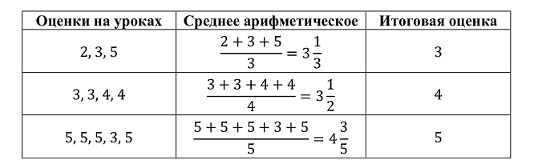

   

      <h1 class="title">E. Улучшение успеваемости</h1>
      <table>
         <tr class="time-limit">
            <td class="property-title">Ограничение времени</td>
            <td>1&nbsp;секунда</td>
         </tr>
         <tr class="memory-limit">
            <td class="property-title">Ограничение памяти</td>
            <td>64Mb</td>
         </tr>
         <tr class="input-file">
            <td class="property-title">Ввод</td>
            <td colspan="1">стандартный ввод или input.txt</td>
         </tr>
         <tr class="output-file">
            <td class="property-title">Вывод</td>
            <td colspan="1">стандартный вывод или output.txt</td>
         </tr>
      </table>
   

   <h2></h2>
   

         
В лицее на уроках информатики ответы учеников оцениваются целым числом баллов от 2 до 5 . Итоговая оценка по информатике выставляется
            как среднее арифметическое оценок на всех уроках, округленное до ближайшего целого числа. Если среднее значение находится
            ровно посередине между двумя целыми числами, то оценка округляется вверх.
         

Примеры округления оценок приведены в таблице.

      
 
      

      
Все ученики лицея стремятся получить итоговую оценку по информатике не ниже 4 баллов. К сожалению, один из учеников получил
         на уроках a двоек, b троек и c четверок. Теперь он планирует получить несколько пятерок, причем хочет, чтобы итоговая оценка
         была не меньше 4 баллов. Ему надо понять, какое минимальное количество пятерок ему необходимо получить, чтобы добиться своей
         цели.
      

      
Требуется написать программу, которая по заданным целым неотрицательные числам a , b и c определяет минимальное количество
         пятерок, которое необходимо получить ученику, чтобы его итоговая оценка по информатике была не меньше 4 баллов.
      

   

   <h2>Формат ввода</h2>
   

         
Входные данные содержат три строки. Первая строка содержит целое неотрицательное число a , вторая строка содержит целое неотрицательное
            число b , третья строка содержит целое неотрицательное число c (0 ≤ a, b, c ≤ 1015, a + b + c ≥ 1).
         

   

   <h2>Формат вывода</h2>
   

         
Выходные данные должны содержать одно число: минимальное число пятерок, которое необходимо получить ученику, чтобы итоговая
            оценка была не меньше 4 баллов.
         

   

   <h2>Пример</h2>
   <table class="sample-tests">
      <thead>
         <tr>
            <th>Ввод</th>
            <th>Вывод</th>
         </tr>
      </thead>
      <tbody>
         <tr>
            <td><pre>2
0
0
</pre></td>
            <td><pre>2
</pre></td>
         </tr>
      </tbody>
   </table>

